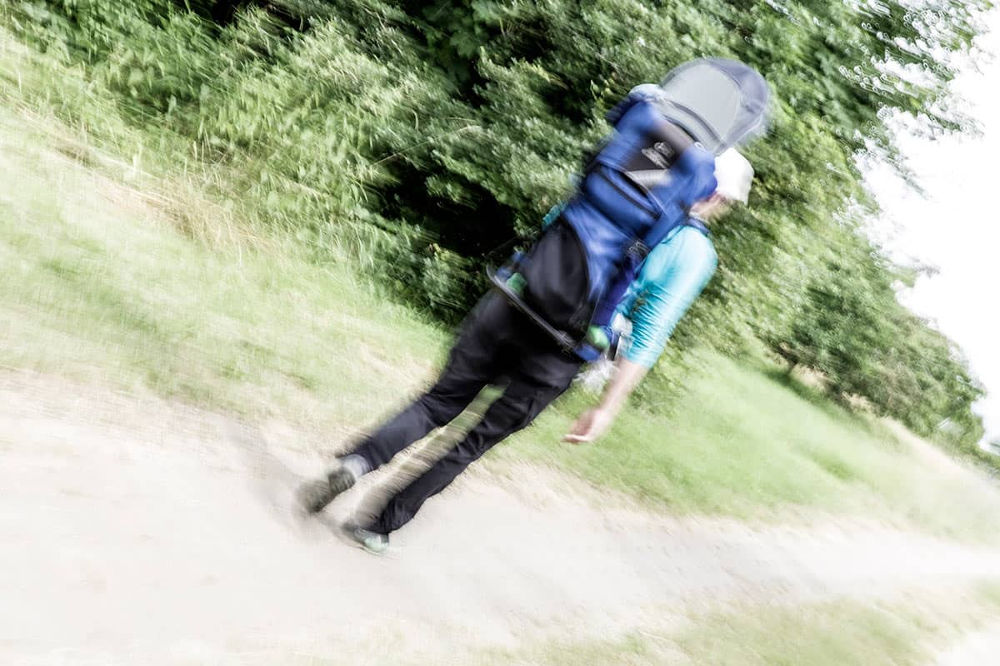
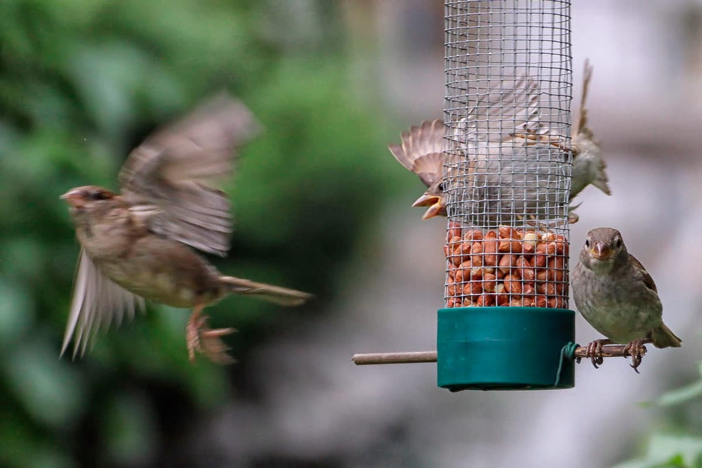

## Schärfe und Unschärfe

Djon Timothy

---

## Überblick
- Schärfe/Unschärfe
- Schärfentiefe
- Anwendungen der selektiven Schärfe
- Bewegungsunschärfe
- Verwendung

---

### **Schärfe**

---

### **Unschärfe**

---

---
### Schärfentiefe

Ein Maß zur Ausdehnung des scharfen Bereichs im Objektraum.

---

Das erreichbare Maß an Schärfentiefe hängt von vier Faktoren ab:

-   Arbeitsblende
-   Aufnahmedistanz
-   Bildwinkel des Objektivs
-   und Aufnahmeformat

Für die Blende gilt: große Öffnung, wenig Schärfentiefe – kleine Öffnung, viel Schärfentiefe.

---

## Mit Schärfe gestalten

---

#### Blickführung durch Schärfezonen

---

#### Blickführung durch Schärfezonen

---

---

#### Bewegungsunschärfe

---

#### Bewegungsunschärfe

---
## Wie scharf muss ein Foto sein?

---

---

---

### Quellen

<a href="https://de.wikipedia.org/wiki/Sch%C3%A4rfentiefe">https://de.wikipedia.org/wiki/Sch%C3%A4rfentiefe</a>
<a href="https://www.terobesarts.de/enzyklopaedie/blende/">https://www.terobesarts.de/enzyklopaedie/blende/</a>
<a href="https://fotoschule.fotocommunity.de/selektive-schaerfe-das-wechselspiel-von-schaerfe-und-unschaerfe/">https://fotoschule.fotocommunity.de/selektive-schaerfe-das-wechselspiel-von-schaerfe-und-unschaerfe/</a>